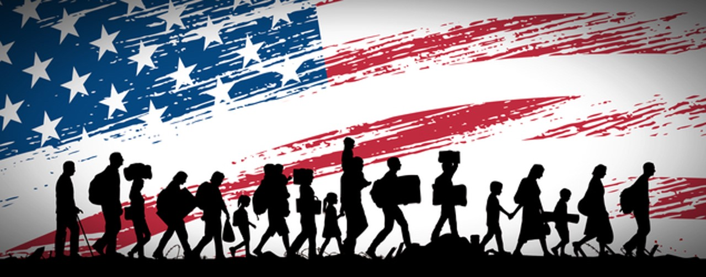

# How does America feel about immigration? 

## Data Analysis about the impact of immigration in the American sentiments.
#### *Project created as part of GWU Data Analytics course.*
> Pandas, Python, Twitter API, Matplotlib, Plotly, Seaborn.

## Objective
Is there a relationship between the foreign-born population and Twitter sentiment on the topic of immigration?  
To explore this question, we matched the Twitter accounts of local NPR-affiliated news stations across the country.  
We combined this data with statistics on the size of the foreign-born population, using the US Census data (5-Year American Community Survey) in order to evaluate the relationship between local sentiment and the population characteristics.   
Tweets and their replies with foreign-born share of the population.   We may experiment with specific Twitter search terms like “immigrant” or the like.  
In order to evaluate related angles, we attached other related data on hate crimes statistics and whether or not a geography had a so-called “sanctuary city”

Twitter Variables
1. News Stories - Sentiment
2. Replies to news stories - Sentiment
3. Story topics on NPR like “immigrant” - Sentiment

## Data Sources

### Census Data

CSV Files:
* FIPS Code List
* Demographics
* Sanctuary Cities
* Immigration Rates

### Crime Data

CSV Files:
* Hate Crime Data (2012-2016)

### APIs

* Twitter API
* Google Geolocation API

## Cleanup Process

During the cleanup process, some valid data was excluded from the dataframes due to incorrect/invalid information in one or more of its columns or because registered location was not found during the geo-location process.

For the tweets analysis, we must consider that even with geo-location, we can not asure that the persons tweeting in that location are locals or actual residents of the city analyzed.

For the hate crime analysis, there are some points to take in consideration for the obtained results:
* Sanctuary cities are more likely to get reports about potential hate crimes by foreign born people (including illegal immigrants) due to the protection provided by the law about not being asked about their migration status.
* Sanctuary cities are more likely to get crimes classified as hate crime report due to the awareness among population and police agencies about the subject.

> “The FBI reports that the numbers of hate crimes have decreased over several years, with the exception of 2015. Regardless of the year, however, the hate crime count is underreported to the FBI, explained Stacy. Some state, city and local police agencies simply don't collect or disclose the data.”
Middlebrook, H, 2017. The fascinating, if unreliable, history of hate crime tracking in the US. CNN, [Online]. Available at: https://www.cnn.com/2017/01/05/health/hate-crimes-tracking-history-fbi/index.html [Accessed 23 April 2018].

## Data Analysis

### Is there a correlation between hate crime rate and foreign born population rate?

### Are sanctuary cities safer in terms of hate crime than other cities?

**__README FILE IN PROGRESS__**
